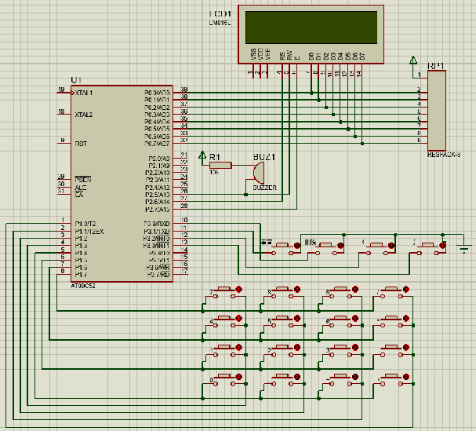
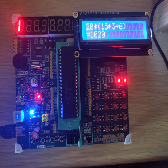
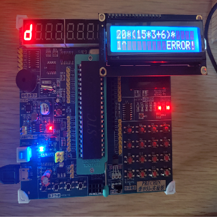

# Simple_calculator
## 介绍 
使用STC89C52完成的包含加减乘和括号的2万以内的优先级运算。
仿真使用Proteus，代码使用keil，对应的工程文件放在对应的目录下。
## 硬件设计
处理芯片选择STC89C52。
输入设备由4*4矩阵键盘与4个单独功能按键组成。
输出设备由一块LCD1602显示屏与蜂鸣器组成。
硬件仿真图如下(省略了晶振与复位电路)：

## 软件设计
该程序使用了逆波兰算法，但STC89C52的内存空间只有几百kb。不借助外部存储器无法存储太多变量。 
所以本程序只支持20000以内的加减乘括号的优先级计算，无法进行带小数的计算，除法计算也很容易出错。
软件流程图如下：

### 4*4矩阵扫描函数
在每个机械时间依次p1.7~p1.4引脚输出低电平,其余输出高电平,若此时4*4矩阵有被按下,在其所在行引脚输出低电平时,其所在列对应的引脚将因为与行引脚导通变为低电平,同时停止扫描,当所按下按键复位时恢复并获取按键位置。 
这样就可以做到用八个引脚实现16个按键的输入。但若同时按下多个按键不会输出后按下的按键。
### 逆波兰算法
因为STC89C52的内存空间只有几百kb,储存逆波兰表达式的结构会占据大量空间，所以不能生成逆波兰表达式来计算。 
本程序采用了一种可以实时计算的逆波兰算法来解决这个问题。这样只需要建立两个栈大大节省了空间。 
其思想如下：
1. 初始化两个栈：运算符栈：s1中间数据栈：s2。
2. 从左到右扫描表达式，遇到数时压入s2栈。
3. 遇到操作数时，将其压入 s24.遇到运算符时比较它与 s1 栈顶运算符的优先级：
   1. 如果 s1 为空，或则栈顶运算符号为(,则将其压入符号栈 s1。
   2. 否则，若优先级比栈顶运算符高，也将其压入符号栈 s1。
   3. 否则，若优先级比栈顶运算符低或相等，将s1栈顶的运算符弹出，并将s2栈顶的两个元素弹出按弹出的运算符计算，在将结果重新压入s2栈。重复①步骤。
4. 遇到括号时：
   1. 如果是左括号 (：则直接压入 s1。
   2. 如果是右括号)：则依次弹出s1栈顶的运算符,并计算s2,直到遇到左括号(为止。
5. 重复1~5，直到表达式结束，结果就是s2栈底的元素。

## 效果
效果如下：
|||
|:---|:---|

## 改进
应该可以通过将数据转换成字符进行逐位模拟手工计算来实现不增加外部存储器的大数据加减乘除括号的优先级运算。 
或者通过加装外部存储器来达到加减乘除括号的优先级运算，不过要想实现超过数据类型存储范围的大数据运算还是要转换成字符进行逐位模拟手工计算来实现。

---
## 相关地址
[项目地址](https://github.com/hy-9/Simple_calculator)

[个人博客](http://haiyao.site "haiyao.site")